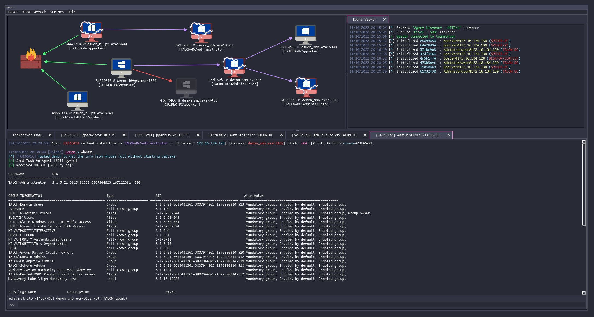
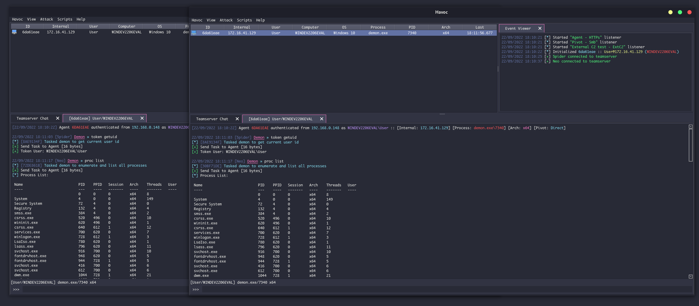
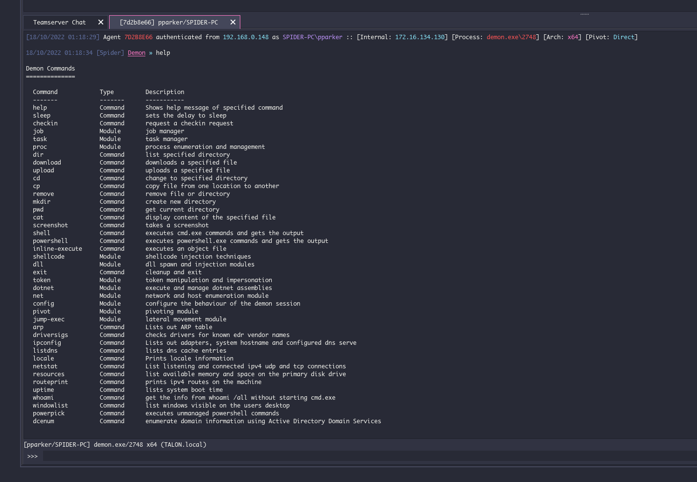

<div align="center">
  
  <h1>Havoc</h1>
  <br/>

  <p><i>Havoc is a modern and malleable post-exploitation command and control framework.</i></p>
  <br />

  <br />
  <br />

</div>

---

### Quick Start

> Please see the [Wiki](https://github.com/HavocFramework/Havoc/wiki) for complete documentation.

See the [Installation](https://havocframework.com/docs/installation) docs for instructions. If you run into issues, check the [Known Issues](https://github.com/HavocFramework/Havoc/wiki#known-issues) page as well as the open/closed [Issues](https://github.com/HavocFramework/Havoc/issues) list.

#### Prerequisites

| Dependency | Purpose |
|------------|---------|
| `go` (1.21+) | Teamserver compilation |
| `mingw-w64` | Cross-compilation of Demon agent for Windows |
| `nasm` | Assembly compilation for agent components |
| `Qt6` | Client GUI framework |
| `Python 3.10+` | Client scripting API and module support |
| `CMake 3.16+` | Client build system |

#### Build

```bash
# Build everything (teamserver + client)
make all

# Build components individually
make ts-build           # Teamserver only
make client-build       # Client only
make client-build-mac   # Client on macOS

# Quick recompile during development
make dev-ts-compile     # Teamserver only (skips dependency setup)
```

#### Run

```bash
# Start the teamserver
./havoc server --profile ./profiles/havoc.yaotl -v --debug

# Start the client GUI
./havoc client
```

---

### Features

#### Client

> Cross-platform UI written in C++ and Qt

- Modern, dark theme based on [Dracula](https://draculatheme.com/)
- Embedded Python scripting API for automation
- Multi-operator support with simultaneous sessions
- Session graph visualization for pivot chains


#### Teamserver

> Written in Golang

- Multiplayer - multiple operators on a single server
- Payload generation (exe/shellcode/dll)
- HTTP/HTTPS listeners with malleable C2 profiles
- SMB listeners for internal pivoting
- External C2 support for custom transport channels
- SQLite database for session persistence
- WebSocket-based client communication


#### Demon

> Havoc's flagship agent written in C and ASM

- Sleep Obfuscation via Ekko, Ziliean or [FOLIAGE](https://github.com/SecIdiot/FOLIAGE)
- x64 return address spoofing
- Indirect Syscalls for Nt* APIs
- SMB support for peer-to-peer pivoting
- Token vault for credential management
- Variety of built-in post-exploitation commands
- Patching AMSI/ETW via hardware breakpoints
- Proxy library loading
- Stack duplication during sleep
- COFF Loader for Beacon Object Files (BOFs)
- In-process .NET assembly execution

<div align="center">
  <br />
</div>

#### Extensibility

- [External C2](https://github.com/HavocFramework/Havoc/wiki#external-c2)
- Custom Agent Support
  - [Talon](https://github.com/HavocFramework/Talon)
- [Python API](https://github.com/HavocFramework/havoc-py)
- [Modules](https://github.com/HavocFramework/Modules)

---

### Profiles

Havoc uses `.yaotl` configuration profiles (HCL-based syntax) to define teamserver settings, operators, listeners, and agent behavior. Profiles are located in the `profiles/` directory.

#### Profile Structure

A profile consists of the following top-level blocks:

| Block | Required | Description |
|-------|----------|-------------|
| `Teamserver` | Yes | Server bind address, port, and build tool paths |
| `Operators` | Yes | Operator usernames and passwords for authentication |
| `Demon` | Yes | Agent sleep interval, jitter, injection settings |
| `Listeners` | No | HTTP/HTTPS/SMB listener configurations |
| `Service` | No | External C2 service endpoint configuration |
| `WebHook` | No | Discord/Slack webhook for session notifications |

#### Teamserver Block

Defines where the teamserver listens and where to find cross-compilation tools.

```hcl
Teamserver {
    Host = "0.0.0.0"       # Bind address
    Port = 40056            # Bind port (client connects here)

    Build {
        Compiler64 = "/usr/bin/x86_64-w64-mingw32-gcc"
        Compiler86 = "/usr/bin/i686-w64-mingw32-gcc"
        Nasm       = "/usr/bin/nasm"
    }
}
```

#### Operators Block

Each `user` block defines an operator that can authenticate to the teamserver.

```hcl
Operators {
    user "operator" {
        Password = "password1234"
    }
}
```

#### Demon Block

Controls the default behavior of generated Demon agents.

```hcl
Demon {
    Sleep  = 2       # Base sleep interval in seconds
    Jitter = 15      # Jitter percentage (0-100)

    TrustXForwardedFor = false  # Trust X-Forwarded-For header for IP resolution

    Injection {
        Spawn64 = "C:\\Windows\\System32\\notepad.exe"    # Process to spawn for x64 injection
        Spawn32 = "C:\\Windows\\SysWOW64\\notepad.exe"    # Process to spawn for x86 injection
    }
}
```

**Sleep & Jitter**: A sleep of `2` with jitter `15` means the agent calls back every 1.7-2.3 seconds. For long-haul operations, increase sleep to 30-60+ seconds.

**Injection targets**: The `Spawn64`/`Spawn32` processes are used for fork-and-run operations (e.g., executing BOFs, .NET assemblies). Choose processes that blend into the target environment.

#### Listeners Block

##### HTTP/HTTPS Listener

```hcl
Listeners {
    Http {
        Name         = "HTTPS Listener"
        Hosts        = ["10.0.0.10"]         # Callback host(s) the agent connects to
        HostBind     = "0.0.0.0"             # Address the listener binds to
        HostRotation = "round-robin"         # How multiple hosts are selected
        PortBind     = 443                   # Port to bind on
        PortConn     = 443                   # Port the agent connects to
        Secure       = true                  # Enable TLS (HTTPS)
        KillDate     = "2025-12-31 23:59:59" # Agent self-terminates after this date
        UserAgent    = "Mozilla/5.0 (Windows NT 10.0; Win64; x64) AppleWebKit/537.36"

        Uris = ["/api/v1/status"]            # URI paths for agent callbacks

        Headers = [                          # Custom request headers
            "Accept: application/json",
        ]

        Response {
            Headers = [                      # Custom response headers
                "Content-Type: application/json",
                "Server: nginx",
            ]
        }
    }
}
```

**Key options**:
- `Hosts` - Can list multiple IPs/domains for redundancy; the agent rotates through them
- `HostRotation` - `round-robin` or `random`
- `Secure` - Set `true` for HTTPS (auto-generates self-signed certs), `false` for HTTP
- `KillDate` - Format: `YYYY-MM-DD HH:MM:SS`. Agent stops executing after this timestamp
- `Uris` - Multiple URIs can be specified; agent randomly selects one per callback

##### SMB Listener

Used for internal pivoting between agents via named pipes.

```hcl
Listeners {
    Smb {
        Name     = "SMB Pivot"
        PipeName = "havoc_pipe"   # Named pipe path (\\.\pipe\<PipeName>)
    }
}
```

#### Service Block (External C2)

Enables the External C2 API for custom transport channels.

```hcl
Service {
    Endpoint = "service-endpoint"   # API endpoint path
    Password = "service-password"   # Authentication password
}
```

#### WebHook Block

Send notifications to Discord when new sessions connect.

```hcl
WebHook {
    Discord {
        Url       = "https://discord.com/api/webhooks/..."  # Webhook URL
        AvatarUrl = "https://example.com/avatar.png"        # Bot avatar (optional)
        User      = "Havoc"                                  # Bot username (optional)
    }
}
```

#### Example Profiles

Several example profiles are included in `profiles/`:

| Profile | Description |
|---------|-------------|
| `havoc.yaotl` | Basic default profile with minimal configuration |
| `http.yaotl` | Plain HTTP listener with SharePoint/OneDrive sync cover |
| `https.yaotl` | TLS-encrypted listener with Outlook/Exchange cover |
| `http_smb.yaotl` | HTTP listener with Teams-themed malleable profile + SMB pivot |
| `webhook_example.yaotl` | Discord webhook notification example |
| `long_haul.yaotl` | Low-and-slow profile for persistent long-term operations |
| `redirector.yaotl` | Profile configured for use behind a redirector/CDN |
| `smb_only.yaotl` | SMB-only lateral movement profile (no external HTTP) |

---

### Community

You can join the official [Havoc Discord](https://discord.gg/z3PF3NRDE5) to chat with the community!

### Note

Please do not open any issues regarding detection.

The Havoc Framework hasn't been developed to be evasive. Rather it has been designed to be as malleable & modular as possible, giving the operator the capability to add custom features or modules that evade their target's detection systems.
